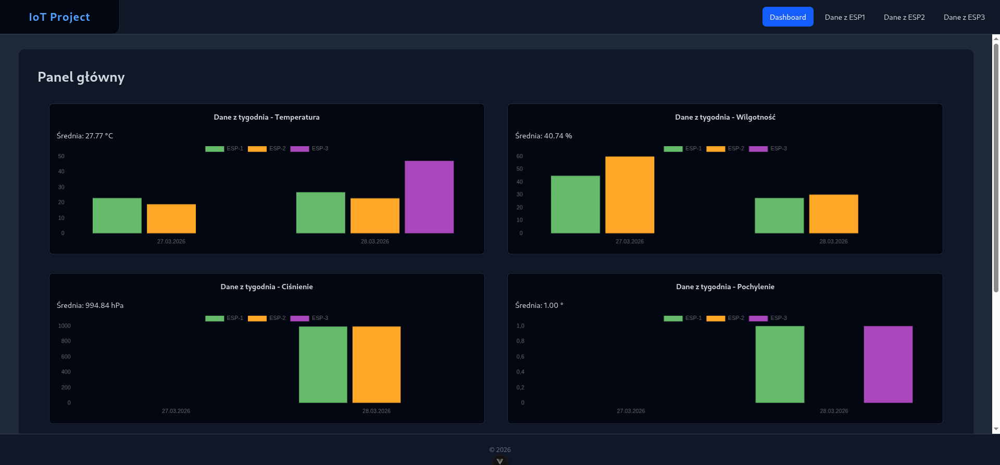
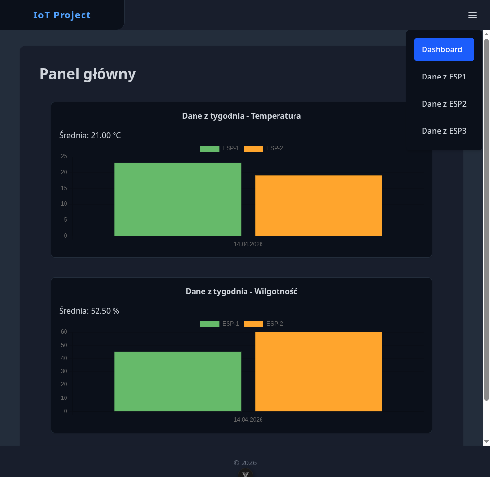
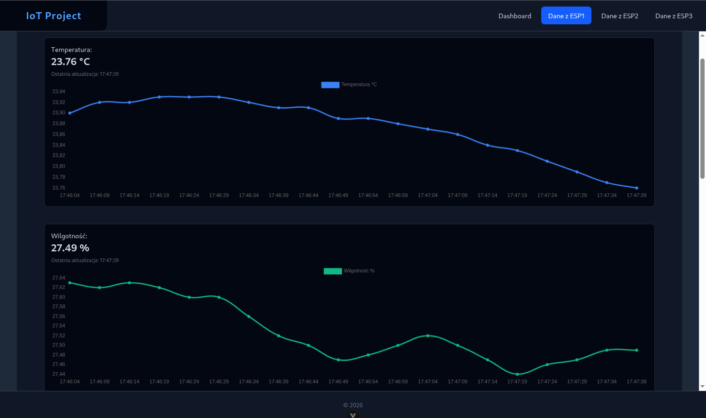
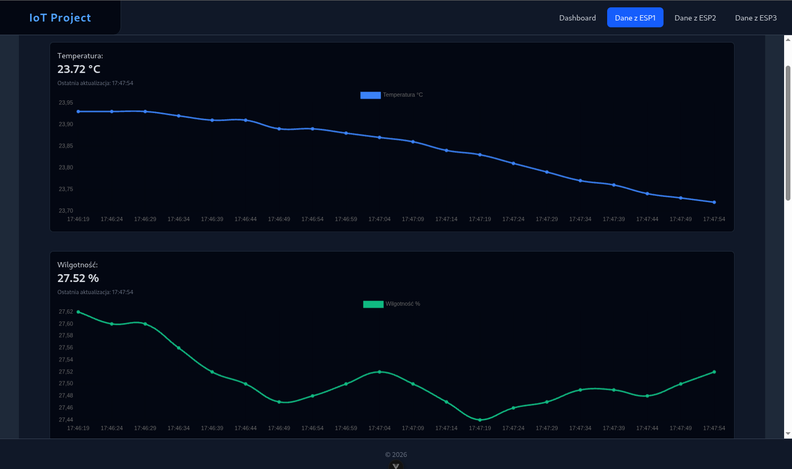

# Projekt IoT na Raspberry Pi

Rozwiązanie ma za zadanie zbierać informacje z node'ów (np. ESP32), przechowywać oraz je wyświetlać. Projekt jest kompleksową aplikacją przystosowaną do działania na Raspberry Pi ale można ją uruchomić na dowolnym komputerze. Całość jest skonteneryzowana tak, aby ułatwić jej uruchomienie oraz konfigurację.

## 🧩 Komponenty rozwiązania

Rozwiązanie składa się z następujących elementów. Każda z usług wykorzystuje dedykowane technologie i jest dostępna pod określonym portem:

| Usługa           |       Technologia       | Port |
| :--------------- | :---------------------: | :--: |
| Frontend         |         Vue.js          | 5173 |
| Backend          |          Flask          | 5000 |
| Baza danych      | TimescaleDB(PostgreSQL) | 5433 |
| Zarządzanie bazą |        pgAdmin4         | 5050 |

### Frontend

Frontend
Aplikacja SPA stworzona w ekosystemie Vue.js z wykorzystaniem TypeScriptu. Została zaprojektowana z myślą o płynnym i responsywnym wyświetlaniu danych z czujników IoT, wykorzystując do tego komunikację w czasie rzeczywistym.

#### Wizualizacja

**Strona główna**


**Strona główna na węższych wyświetlaczach**


**Podgląd danych rzeczywistych z czujników**



#### 📦 Główne technologie i biblioteki:

**Tailwind CSS** – Odpowiada za warstwę wizualną i responsywność interfejsu.

**Socket.io-client** – Obsługa połączenia WebSocket umożliwiająca odczyty z czujników na żywo.

**Pinia** – Zarządzanie stanem globalnym aplikacji. Zapisuje ostatnie obecne wartości odczytane poprzez websockety z czujników, aby użytkownik po odświeżeniu widział w dalszym ciągu poprzednie odczyty.

**Chart.js & Vue-chartjs** – Renderowanie wykresów.

**Axios** – Klient HTTP do obsługi standardowych żądań REST API (pobieranie historii danych).

**Vue Router** – Zarządzanie nawigacją pomiędzy widokami bez przeładowywania strony.

### Backend

Aplikacja serwerowa została napisana w języku **Python** przy użyciu frameworka **Flask**. Odbiera dane z node'ów, zapisuje je w bazie danych i na bieżąco rozsyła do połączonych klientów (frontendu).

#### 📦 Główne technologie i biblioteki:

- **Paho MQTT** – Klient protokołu MQTT, służący do nasłuchiwania wiadomości nadawanych przez Node'y.
- **Flask-CORS** – Obsługa żądań HTTP oraz polityki CORS.
- **Flask-SocketIO** – Technologia WebSockets używana do wysyłania danych z czujników do aplikacji klienckiej w czasie rzeczywistym.
- **Flask-SQLAlchemy** – ORM do komunikacji z bazą danych.

#### ⚙️ Kluczowe funkcje systemu:

1. **Optymalizacja dla Szeregów Czasowych (TimescaleDB):**
   Backend podczas startu automatycznie sprawdza i inicjalizuje strukturę bazy danych. Wykorzystuje surowe zapytanie SQL (`create_hypertable`), aby przekształcić standardową tabelę `sensor_readings` w _Hypertable_ – strukturę zoptymalizowaną pod kątem ogromnych ilości danych związanych z czasem.
   Przechowywane metryki to m.in.: `temperature`, `pressure`, `humidity`, `tilt` oraz `light`.

2. **Obsługa protokołu MQTT:**
   Gdy aplikacja działa w trybie produkcyjnym, łączy się z lokalnym brokerem MQTT (port `1883`) i subskrybuje temat `sensors/+`. Kiedy układ ESP o danym id wyśle nowy pomiar, backend go parsuje, zapisuje w bazie i natychmiast wysyła do frontendu przez WebSockets.

3. **Tryb Symulacji (Fake Data):**
   Projekt posiada wbudowany tryb deweloperski, kontrolowany zmienną środowiskową `FAKE_DATA`. Jeśli jest ona ustawiona na `true`, backend ignoruje brokera MQTT i uruchamia asynchroniczne procesy w tle, które generują sztuczne (losowe) dane dla temperatury i ciśnienia. Jest to idealne rozwiązanie do testowania interfejsu bez fizycznego sprzętu.

#### 🔗 Główne Endpointy API:

- **`WebSocket (Wydarzenie: sensor_update)`** – Główny kanał komunikacji na żywo. Przesyła obiekty JSON zawierające ID czujnika (`esp_id`) oraz jego aktualne odczyty.
- **`GET /api/sensor/week/<sensor_type>`** – Endpoint analityczny. Zwraca zagregowane dane z ostatnich 7 dni dla wybranego typu czujnika (np. `temperature`, `humidity`). Backend oblicza tu m.in. średnią dzienną wartość dla każdego z mikrokontrolerów.
- **`GET /test/`** – Prosty endpoint kontrolny sprawdzający, czy serwer API poprawnie odpowiada na zapytania HTTP.

## 🚀 Uruchomienie lokalne

Aby uruchomić projekt na swoim urządzeniu (np. Raspberry Pi lub lokalnym komputerze), postępuj zgodnie z poniższymi instrukcjami.

### Wymagania

- Zainstalowany **Docker** oraz **Docker Compose**

Zalecane obecny w sieci **Broker MQTT**(np. mosquitto) oraz odpowienio skonfigurowane node'y.

### Kroki instalacji

1. **Sklonuj repozytorium:**
   ```bash
   git clone [https://github.com/JakubJakacki18/iot-project-rbpi.git](https://github.com/JakubJakacki18/iot-project-rbpi.git)
   cd iot-project-rbpi
   ```
2. **Stwórz plik `.env` na podstawie `.env.example` i skonfiguruj go zgodnie z potrzebami**
3. **Uruchom docker compose**
   ```bash
   docker compose up --build
   ```

## Autor

**Jakub Jakacki**
